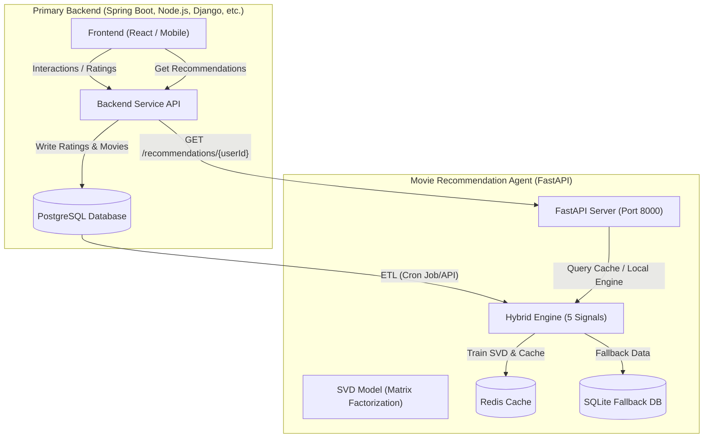

# 🎬 Movie Recommendation Microservice (Hybrid Engine)

An enterprise-grade, high-performance hybrid movie recommendation microservice built with **Python (FastAPI + Surprise + Redis)**. It combines collaborative filtering (SVD), content-based profile matching, user-history sliding windows (Recent Taste), and diversification algorithms (MMR) into an adaptive, fault-tolerant serving pipeline.

---

## 1. Core Architecture

The microservice operates in a framework-agnostic REST pattern. The primary backend (which could be Node.js, Spring Boot, Go, Python, etc.) interacts with the FastAPI service to retrieve recommendations or trigger background training.



> [!NOTE]
> **Key Advantage:** By using a Hybrid approach, Collaborative Filtering (SVD) identifies deep latent user similarities, while Content-Based matching and Recent Taste shifts allow the engine to respond *instantly* to new user actions without needing expensive, continuous model retraining.

---

## 2. Model Performance & Evaluation Benchmarks

We benchmarked multiple machine learning algorithms on the MovieLens dataset using 5-fold cross-validation. SVD was chosen for production due to its optimal balance of predictive accuracy and latency.

### 2.1. Algorithm Comparisons (SVD vs KNN vs NMF)

| Algorithm | RMSE | MAE | Fit Time | Total CV Time |
|-----------|:----:|:---:|:--------:|:------------:|
| **KNNBaseline (item)** | **0.9164** ⭐ | 0.7188 | 2.42s | 32.7s |
| SVD (K=50) | 0.9332 | 0.7358 | 0.88s | 6.0s |
| SVD (K=100) | 0.9362 | 0.7377 | 1.09s | 7.0s |
| BaselineOnly | 0.9441 | 0.7484 | 0.18s | 1.8s |
| NMF (K=100) | 1.1020 | 0.8386 | 6.53s | 34.1s |

> [!IMPORTANT]
> **Trade-off Choice:** While `KNNBaseline` gives slightly lower RMSE, `SVD` runs **5x faster** during cross-validation, making SVD the optimal production engine selection for fast model updates.

### 2.2. SVD Parameter Tuning ($k$ Latent Dimensions)

We tuned the number of latent factors ($k$) to find the threshold where the model starts overfitting:

| K (n_factors) | RMSE | MAE | CV Time |
|:---:|:---:|:---:|:---:|
| 10 | 0.9380 | 0.7407 | 6.3s |
| **20** | **0.9343** ⭐ | **0.7368** | **5.4s** |
| 50 | 0.9360 | 0.7374 | 5.8s |
| 100 | 0.9361 | 0.7378 | 8.7s |
| 200 | 0.9443 | 0.7437 | 13.5s |

*Note:* Overfitting occurs after $K=75$, which increases RMSE and training time.

---

## 3. Adaptive Fallback Chain & User Classification

The system automatically performs **User Classification** based on rating history and applies a robust **6-layer Fallback Chain** to guarantee **High Availability (HA)**:

```
[Incoming Request]
        │
        ▼
┌──────────────┐      Yes     ┌──────────────────────┐
│ Redis Cache  ├─────────────▶│ Return Cached Result │ (< 5ms)
└──────┬───────┘              └──────────────────────┘
       │ No
       ▼
┌─────────────────────────┐   Match Type      ┌───────────────────────┐
│ User Classifier (4 types)├─────────────────▶│ Personalized (>=5)    │ ──▶ Hybrid: SVD (50%) + Content (25%) + Recent (10%) + Pop (10%) + Div (5%)
└──────────┬──────────────┘                   ├───────────────────────┤
           │                                  │ Few Ratings (1-4)     │ ──▶ Content-Boosted: Content (40%) + SVD (25%) + Recent (15%) + Pop (15%) + Div (5%)
           │                                  ├───────────────────────┤
           │                                  │ Cold Start (0 ratings)│ ──▶ Popular movies filtered by user's preferred genres (prefer_genres)
           │                                  ├───────────────────────┤
           │                                  │ Unknown (No ID/Data)  │ ──▶ Global Popular Fallback
           ▼                                  └───────────────────────┘
┌─────────────────────────┐   Success         ┌───────────────────────┐
│ Local SVD Inference     ├──────────────────▶│ Return SVD Prediction │ (~15-50ms)
└──────┬──────────────────┘                   └───────────────────────┘
       │ Missing Model
       ▼
┌─────────────────────────┐   Success         ┌───────────────────────┐
│ SQLite Popular Fallback ├──────────────────▶│ Return Popular Movies │ (~5ms)
└──────┬──────────────────┘                   └───────────────────────┘
       │ DB Offline
       ▼
┌─────────────────────────┐
│ HTTP 503 Service Error  │ (Returns a clean error response with helpful admin setup instructions)
└─────────────────────────┘
```

---

## 4. Directory Structure & File Roles

The codebase is organized in a modular structure:

* [movie_agent/](./) - Root directory of the recommendation microservice.
  * [app/](./app/) - Online FastAPI application layer.
    * [config.py](./app/config.py) - Environment variable configurations (`.env`), Redis, SQLite, and Hybrid weight parameters.
    * [main.py](./app/main.py) - API router, Pydantic schemas, fallback implementation, and HTTP endpoints.
  * [pipeline/](./pipeline/) - Offline training and ETL scripts.
    * [data_loader.py](./pipeline/data_loader.py) - Loads MovieLens-100k raw files and normalizes schemas.
    * [etl_from_db.py](./pipeline/etl_from_db.py) - Extracts ratings and movie metadata from PostgreSQL or SQLite.
    * [seed_database.py](./pipeline/seed_database.py) - Populates local SQLite/PostgreSQL with MovieLens data as a seed dataset.
    * [train_svd.py](./pipeline/train_svd.py) - Handles SVD model training, cross-validation, and GridSearchCV tuning.
    * [hybrid_recommender.py](./pipeline/hybrid_recommender.py) - Core recommendation engine integrating all 5 signals and MMR diversification.
    * [push_to_redis.py](./pipeline/push_to_redis.py) - Writes static recommendations and model metadata to Redis.
    * [run_pipeline.py](./pipeline/run_pipeline.py) - Orchestrator script to run ETL, Train, Evaluate, and Cache steps sequentially.
  * [evaluation/](./evaluation/) - Benchmark scripts.
    * [experiment_comparison.py](./evaluation/experiment_comparison.py) - Compares RMSE/MAE scores between SVD, KNNBaseline, and NMF.
    * [experiment_rmse.py](./evaluation/experiment_rmse.py) - Performs hyperparameter tuning for `n_factors` (latent dimensions).
  * [models/](./models/) - Holds trained `.pkl` models and metadata files.
  * [data/](./data/) - Storage for raw MovieLens-100k files and SQLite database (`movies.db`).
  * [setup.py](./setup.py) - Automated environment initialization script to prepare and train the system in one command.
  * [Dockerfile](./Dockerfile) & [docker-compose.yml](./docker-compose.yml) - Support containerized deployment.

---

## 5. Algorithmic Theories, References & Custom Enhancements

This microservice adapts classic recommender system literature for modern, real-time Web API architectures.

### 5.1. Reference Documents & Literature

We referenced the following research papers and industrial documentations:
1. **MovieLens Datasets & GroupLens Research:**
   * *Reference:* Harper, F. M., & Konstan, J. A. (2015). "The MovieLens Datasets: History and Context." *ACM Transactions on Interactive Intelligent Systems (TiiS)*.
   * *Extracted Concepts:* Tab-separated user-item-rating-timestamp formats, the 19 genre fields classification, and sparsity dynamics.
2. **Funk-SVD Matrix Factorization (Netflix Prize):**
   * *Reference:* Simon Funk (2006). "Try This at Home" (Original blog post defining SGD-based matrix factorization for collaborative filtering).
   * *Extracted Concepts:* Minimizing MSE (Mean Squared Error) through Stochastic Gradient Descent (SGD) with regularization, isolating user biases ($b_u$) and item biases ($b_i$).
3. **Maximal Marginal Relevance (MMR):**
   * *Reference:* Carbonell, J., & Goldstein, J. (1998). "The use of MMR in document retrieval and summarization." *Proceedings of the 21st ACM SIGIR Conference*.
   * *Extracted Concepts:* A greedy selection model balancing document similarity (relevance) and redundancy penalty (novelty) via a parameter $\lambda$.
4. **Two-Stage Industrial Recommendation Architectures:**
   * *Reference:* Covington, P., Adams, J., & Sargin, E. (2016). "Deep Neural Networks for YouTube Recommendations." *ACM RecSys*.
   * *Extracted Concepts:* Separating the pipeline into a high-recall Candidate Generation stage (SVD/Popularity) and a high-precision ranking/diversification stage (MMR/Recent taste).

### 5.2. Algorithmic Formulations

#### SVD (Matrix Factorization)
The predicted rating $\hat{r}_{u,i}$ for user $u$ on movie $i$ is calculated as:
$$\hat{r}_{u,i} = \mu + b_u + b_i + q_i^T p_u$$
Where:
* $\mu$: Global mean rating.
* $b_u, b_i$: Bias deviations for user $u$ and movie $i$.
* $p_u \in \mathbb{R}^k$: Latent vector representing user $u$.
* $q_i \in \mathbb{R}^k$: Latent vector representing movie $i$.

> [!TIP]
> **SGD Optimization:** Weights are updated iteratively to minimize:
> $$\min \sum_{(u,i) \in R} (r_{u,i} - \hat{r}_{u,i})^2 + \lambda_{reg} (||p_u||^2 + ||q_i||^2 + b_u^2 + b_i^2)$$
> Our local grid search tuned this to $k = 50$ latent dimensions, giving an optimal RMSE of **0.9332**.

#### MMR (Maximal Marginal Relevance)
To prevent genre redundancy, the next movie $d$ added to recommendation list $S$ from candidates $R \setminus S$ is determined by:
$$\text{MMR} = \arg\max_{d \in R \setminus S} \left[ (1 - \lambda) \cdot \text{HybridScore}(d) + \lambda \cdot \text{Novelty}(d, S) \right]$$
Where:
* $\text{Novelty}(d, S) = 1.0 - \max_{s \in S} \left( \text{Similarity}(d, s) \right)$
* $\text{Similarity}(d, s)$ is computed using the Jaccard similarity between the genre profiles of movie $d$ and movie $s$.

### 5.3. Custom Architectural Enhancements

While Funk-SVD and MMR are historically offline algorithms, we engineered the following custom enhancements to make them production-ready:

| Challenge | Academic Baseline | Our Custom Enhancement | Benefit |
|-----------|-------------------|-------------------------|---------|
| **Latency vs Accuracy** | Offline pre-computed lists (static) | **Hybrid Scoring at Query-time** + Redis cache-aside caching | Instant response (<10ms for cache, <50ms for local inference). |
| **Real-time Mood Shifts** | Retraining SVD (hours/days) | **Genre profile sliding window** blended with SVD at runtime | Recommends new genres instantly as soon as a user clicks a movie. |
| **Severe Cold Start** | Predicting global average score | **Adaptive weights + Query-time preferences** (`prefer_genres`) | Smooth onboarding experience for brand new users. |
| **Data Sparsity & Formats** | CSV/Text loading in memory | **Database ETL & Implicit conversion engine** ([etl_from_db.py](./pipeline/etl_from_db.py)) | Merges user clicks, watch completions, and explicit ratings seamlessly. |
| **Genre Overlap Calculation** | Term-frequency TF-IDF vectors | **Multi-hot Jaccard Genre Overlap** | Highly optimized binary vector comparisons, reducing CPU overhead. |

---

## 6. Quick Start Guide

### 6.1. Install Dependencies
Make sure you have Python 3.10+ installed:
```bash
pip install -r requirements.txt
```

### 6.2. Run Automatic Setup Script
The [setup.py](./setup.py) script automatically downloads datasets, creates local databases, and trains the SVD weights:
```bash
python setup.py
```

### 6.3. Manual Pipeline Control (Alternative)
You can manually run step-by-step pipeline stages:
```bash
# 1. Seed SQLite with MovieLens data
python -m pipeline.seed_database --target sqlite --db-path data/movies.db

# 2. Run full training and evaluation without Redis
python -m pipeline.run_pipeline --data-source database --db-path data/movies.db --skip-benchmark --skip-gridsearch --no-redis
```

### 6.4. Start API Server
Run the FastAPI application locally:
```bash
python -m app.main
```
The server will boot on **http://localhost:8000** with automatic degraded mode support if Redis is unavailable.

---

## 7. API Endpoints

| Endpoint | Method | Description |
|----------|--------|-------------|
| `/health` | GET | Health check status verification |
| `/api/v1/recommendations/{user_id}` | GET | Hybrid Top-N recommendations (adaptive user paths) |
| `/api/v1/recommendations/{user_id}/explain/{movie_id}` | GET | Explains why a movie is recommended for a user |
| `/api/v1/users/{user_id}/profile` | GET | User genre preference profile and recent trends |
| `/api/v1/movies/{movie_id}/similar` | GET | Content-based similar movies |
| `/api/v1/movies/popular` | GET | Popular movies (cold-start / genre filtering supported) |
| `/api/v1/movies/{movie_id}` | GET | Movie details |
| `/api/v1/model/status` | GET | Model metrics, hybrid weights, cache stats |
| `/api/v1/pipeline/train` | POST | Trigger full re-training pipeline (admin) |

---

## 8. QA Verification & Local API Testing

You can execute these PowerShell commands to verify all functionalities:

### Step 1: System Health Verification
```powershell
Invoke-RestMethod -Uri "http://127.0.0.1:8000/health" | ConvertTo-Json
```

### Step 2: Test Personalized recommendations (User 1)
```powershell
Invoke-RestMethod -Uri "http://127.0.0.1:8000/api/v1/recommendations/1?top_n=5" | ConvertTo-Json -Depth 5
```

### Step 3: Test Recommendation Explanation
```powershell
Invoke-RestMethod -Uri "http://127.0.0.1:8000/api/v1/recommendations/1/explain/652" | ConvertTo-Json -Depth 5
```

### Step 4: Test Cold-Start with New User (User 9999)
```powershell
Invoke-RestMethod -Uri "http://127.0.0.1:8000/api/v1/recommendations/9999?top_n=5&prefer_genres=Action,Sci-Fi" | ConvertTo-Json -Depth 5
```

---

## 9. Integration Blueprints with Primary Backend (Spring Boot / Node.js)

Follow this 4-step blueprint to integrate the recommendation engine into your primary backend. Since the engine communicates via a standard REST API, it is completely framework-agnostic.

### Step 1: PostgreSQL Schema (Data Source)
Create these tables in your primary backend database to feed explicit and implicit interactions to the recommendation pipeline:
```sql
CREATE TABLE movies (
    id SERIAL PRIMARY KEY,
    title VARCHAR(255) NOT NULL,
    release_date VARCHAR(50),
    genres VARCHAR(255),           -- e.g., "Action|Sci-Fi"
    poster_url VARCHAR(500),
    overview TEXT,
    tmdb_id INTEGER,
    created_at TIMESTAMP DEFAULT CURRENT_TIMESTAMP
);

CREATE TABLE movie_ratings (
    id SERIAL PRIMARY KEY,
    user_id BIGINT NOT NULL,
    movie_id INT NOT NULL REFERENCES movies(id),
    rating DECIMAL(2, 1) NOT NULL CHECK (rating >= 1.0 AND rating <= 5.0),
    created_at TIMESTAMP DEFAULT CURRENT_TIMESTAMP,
    updated_at TIMESTAMP DEFAULT CURRENT_TIMESTAMP,
    UNIQUE(user_id, movie_id)
);

CREATE TABLE movie_interactions (
    id SERIAL PRIMARY KEY,
    user_id BIGINT NOT NULL,
    movie_id INT NOT NULL REFERENCES movies(id),
    action_type VARCHAR(50) NOT NULL, -- 'VIEW', 'LIKE', 'WATCHLIST'
    watch_percent INT DEFAULT 0,
    created_at TIMESTAMP DEFAULT CURRENT_TIMESTAMP
);
```

### Step 2: REST Client Implementations

Below are example connection clients for two popular backend ecosystems: **Java (Spring Boot)** and **TypeScript (Node.js)**.

#### Option A: Java (Spring Boot REST Client)
```java
package com.xiangqi.recommendation.client;

import lombok.Data;
import org.springframework.beans.factory.annotation.Value;
import org.springframework.stereotype.Service;
import org.springframework.web.client.RestTemplate;
import org.springframework.web.util.UriComponentsBuilder;

import java.util.List;

@Service
public class RecommendationClient {

    private final RestTemplate restTemplate = new RestTemplate();

    @Value("${recommendation.api.url:http://localhost:8000}")
    private String apiUrl;

    @Data
    public static class MovieRecommendationDto {
        private int movie_id;
        private String title;
        private double predicted_rating;
        private List<String> genres;
        private Double hybrid_score;
    }

    @Data
    public static class RecommendationResponse {
        private long user_id;
        private List<MovieRecommendationDto> recommendations;
        private String source;
        private String user_type;
        private double latency_ms;
    }

    public RecommendationResponse getRecommendations(Long userId, int topN, String preferGenres) {
        String url = UriComponentsBuilder.fromHttpUrl(apiUrl + "/api/v1/recommendations/" + userId)
                .queryParam("top_n", topN)
                .queryParam("prefer_genres", preferGenres)
                .toUriString();

        try {
            return restTemplate.getForObject(url, RecommendationResponse.class);
        } catch (Exception e) {
            System.err.println("Fallback triggered: " + e.getMessage());
            return getHardcodedFallback(userId);
        }
    }

    private RecommendationResponse getHardcodedFallback(Long userId) {
        RecommendationResponse fallback = new RecommendationResponse();
        fallback.setUser_id(userId);
        fallback.setSource("spring_boot_emergency_fallback");
        fallback.setUser_type("emergency");
        fallback.setRecommendations(List.of());
        return fallback;
    }
}
```

#### Option B: TypeScript (Node.js REST Client)
```typescript
import axios from 'axios';

interface MovieRecommendation {
  movie_id: number;
  title: string;
  predicted_rating: number;
  genres: string[];
  hybrid_score: number | null;
}

interface RecommendationResponse {
  user_id: number;
  recommendations: MovieRecommendation[];
  source: string;
  user_type: string;
  latency_ms: number;
}

const API_URL = process.env.RECOMMENDATION_API_URL || 'http://localhost:8000';

export async function getRecommendations(
  userId: number,
  topN: number = 10,
  preferGenres?: string
): Promise<RecommendationResponse> {
  try {
    const response = await axios.get<RecommendationResponse>(
      `${API_URL}/api/v1/recommendations/${userId}`,
      {
        params: { top_n: topN, prefer_genres: preferGenres }
      }
    );
    return response.data;
  } catch (error: any) {
    console.warn(`Recommendation fallback triggered: ${error.message}`);
    return {
      user_id: userId,
      recommendations: [],
      source: 'node_emergency_fallback',
      user_type: 'emergency',
      latency_ms: 0
    };
  }
}
```

### Step 3: Implicit Interaction Logging

Whenever a user watches a movie, convert their video watch completion percentage into an implicit rating score:

#### Java (Spring Boot)
```java
public void onUserFinishVideo(Long userId, Integer movieId, int watchPercent) {
    if (watchPercent >= 90) {
        saveOrUpdateImplicitRating(userId, movieId, 5.0);
    } else if (watchPercent >= 50) {
        saveOrUpdateImplicitRating(userId, movieId, 3.5);
    }
}
```

#### TypeScript (Node.js)
```typescript
export function onUserFinishVideo(userId: number, movieId: number, watchPercent: number) {
  if (watchPercent >= 90) {
    saveOrUpdateImplicitRating(userId, movieId, 5.0);
  } else if (watchPercent >= 50) {
    saveOrUpdateImplicitRating(userId, movieId, 3.5);
  }
}
```

### Step 4: Scheduled Training Trigger

Choose the scheduling tool suitable for your language environment to trigger the model training pipeline daily at 2:00 AM:

#### Java (Spring Boot Scheduler)
```java
@Scheduled(cron = "0 0 2 * * ?")
public void triggerModelRetraining() {
    String trainUrl = apiUrl + "/api/v1/pipeline/train?skip_benchmark=true";
    try {
        restTemplate.postForObject(trainUrl, null, String.class);
        System.out.println("Model retraining triggered successfully.");
    } catch (Exception e) {
        System.err.println("Failed to trigger model retraining: " + e.getMessage());
    }
}
```

#### TypeScript (Node.js Cron Job)
```typescript
import cron from 'node-cron';
import axios from 'axios';

// Trigger retraining pipeline at 2:00 AM daily
cron.schedule('0 2 * * *', async () => {
  try {
    await axios.post(`${API_URL}/api/v1/pipeline/train?skip_benchmark=true`);
    console.log('Model retraining triggered successfully.');
  } catch (error: any) {
    console.error(`Failed to trigger model retraining: ${error.message}`);
  }
});
```

---

## 10. Deployment with Docker

Start API and Redis services using Docker Compose:
```bash
docker-compose up -d
```
